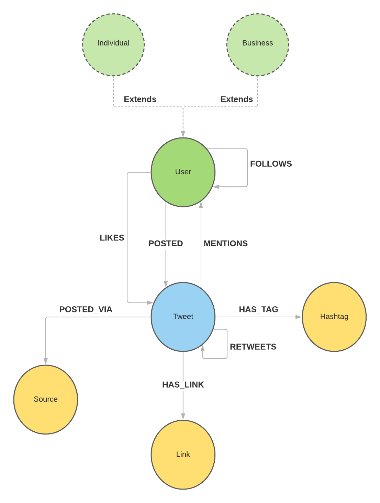

# Graphs and birds

  

## Overview
This repository offers a simple implementation of a modified version [Twitter](https://twitter.com/?lang=en) by using different type of databases. The results queries and performances to answer different questions were presented at [Cabane.io 2021](https://cabane.io/) annual conference.

## Data model
Our data model, very simplified compared to the real Twitter, looks like this: 

  

There is one important detail here regarding the `User`. In twitter, there are not many types of users. 

I wanted however to experiment inheritance, since it's a common problem developers have to face when working in Object Oriented paradigm, and most times, that hierarchy has to be represented in the database as well. For this reason, the `User` is declined in two different concrete types: `Business`, and `Individial`

## Databases
Many databases are compared in this non-exhausive enumeration in the attempt to create the most performant database model to answer classic questions for a social network, while also remaining developer friendly. 

The accent is mostly put on the ease of developing and understanding the different queries, but performances are also considered really heavily.

### PostgreSQL
The first database in our comparison list is a pretty popular one in the SQL world. [PostgreSQL](https://www.postgresql.org/) widely used, extremely powerful and is also the most popular overall because of the numerous plugins available for it.

### MongoDB
The second one on our list is the probably the most popular document database, [MongoDB](https://www.mongodb.com/). It's one of the favorite for its simplicity to get started, its great native features. Not only that, it's designed to run in large clusters to create distributed data centers that scale infinitely. 

### Neo4j 
Next one on our list is by far the most popular Graph database on the market. [Neo4j](https://neo4j.com/) has been around since 2007, but it's gotten more popular only in the last few years, as use-cases for Graph databases seem to multiply.

### ArangoDB
Last but not least on our list is [ArangoDB](https://www.arangodb.com/), that I have personally only heard about very recently. Unlike all other databases, this one is a `multi-model` database. It supports documents, graphs and key-value, all in one! 

## How to run
### Requirements
- Java 11+ 
- Docker with docker-compose to start the databases

### Start the application