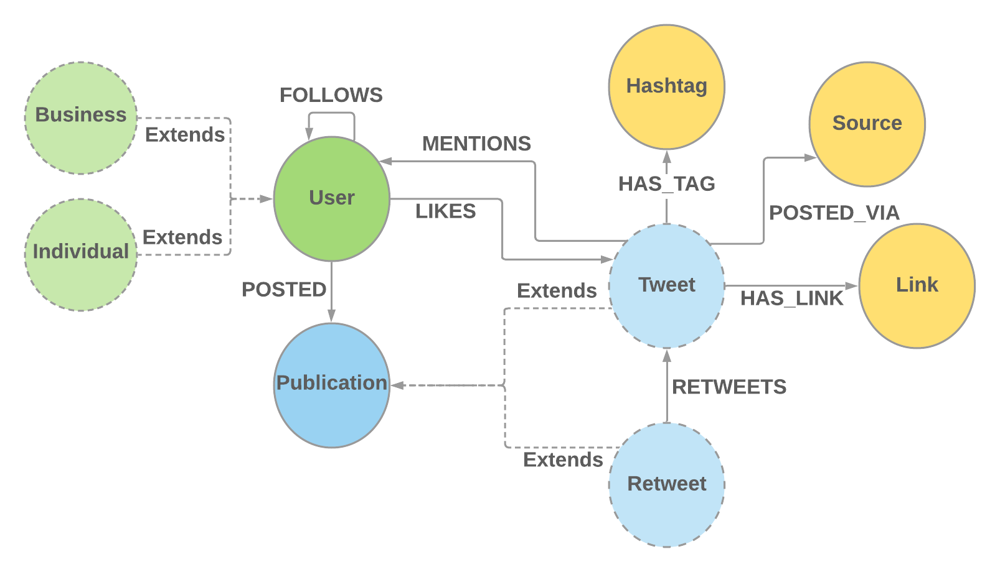

# Graphs and birds

<p align="center">
  
</p>

## Overview

This repository offers a simple implementation of a modified version [Twitter](https://twitter.com/?lang=en) by using
different type of databases. The results queries and performances to answer different questions were presented
at [Cabane.io 2021](https://cabane.io/) conference.

## Results

The results and presentation slides associated to this project will be available shortly...

You can also have fun and create your own queries if you'd like.

## Data model

Our data model, very simplified compared to the real Twitter, looks like this:
<p align="center">
  
</p>

There is one important detail here regarding the `User`. In the real Twitter, there are not many types of users.

I wanted however to experiment inheritance, since it's a common problem developers have to face when working in Object
Oriented paradigm, and most times, that hierarchy has to be represented in the database as well. For this reason,
the `User` is declined in two different concrete types: `Business`, and `Individial`

## Databases

Many databases are compared in this non-exhaustive enumeration in the attempt to create the most performant and
maintainable database model to answer classic questions for a social network, while also remaining developer friendly.

The accent is mostly put on the ease of developing and understanding the different queries, but performances are also
considered.

### PostgreSQL

The first database in our comparison list is a pretty popular one in the SQL
world. [PostgreSQL](https://www.postgresql.org/) widely used, extremely powerful and is also the most popular overall
because of the numerous plugins available for it.

### Neo4j

Next one on our list is by far the most popular Graph database on the market. [Neo4j](https://neo4j.com/) has been
around since 2007, but it's gotten more popular only in the last few years, as use-cases for Graph databases seem to
multiply.

### MongoDB

MongoDB was explored as well to create and compare to the two other databases. The idea was however rapidly abandoned,
as it is fairly complicated to represent a social network with independent documents, considering that every relation is
a possibly infinitely growable mutable list.

To give an idea, I had to use
either [Document References](https://docs.mongodb.com/manual/tutorial/model-referenced-one-to-many-relationships-between-documents/)
, which has a lot of limitations, or map everything manually by doing multiple queries to the database, which would have turned it in a not-so-good SQL
database.

It appeared obvious after a few hours of trying to make it work that a social-network was an anti-use-case for Mongo.

## How to run
### Requirements
- Java 11+
- Docker with docker-compose to start the databases

### Start the application
The source code available here will take care of inserting fake data in both database types automatically. It does so by
creating random users, and assigning to each user a random number of tweets, retweets, likes, mentions, etc.

#### Start the databases
```bash
# For all databases
docker-compose up -d
```

- Neo4j Browser is available at http://localhost:7474
- As for Postgres, choose your favorite IDE

#### Run the application
```bash
./gradlew assemble && java -jar build/libs/cabane.io-twitter.jar
```

Once inside the interactive shell, you can run a suite of commands
```bash
twitter:> help

twitter:> insert-users --inserters postgres,neo4j --count 100  

twitter:> exit
```
You can also start it directly from your IDE

